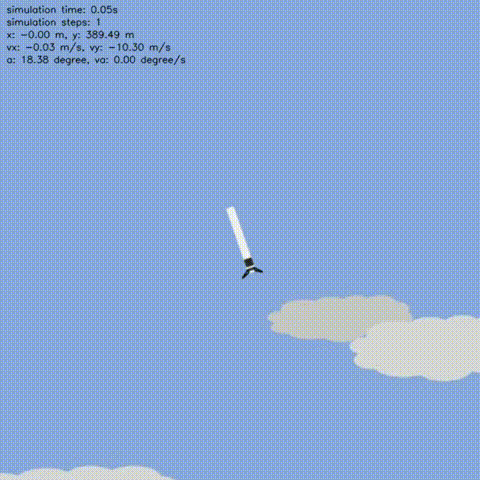

Rocket-recycling
~~~~~~~~~~~~~~~~~~~~~~~

概述
=======

Rocket-recycling 想要通过简单的强化学习“构建”一个虚拟火箭，并解决一个具有挑战性的问题——火箭回收（灵感来源 Space_X 所发射的 Falcon 9 和 SN10）。

.. image:: image/l_11k.gif
   :width: 200
   :align: center

安装 !!! 等待更改
====

安装方法
--------

需要先安装 \ `Rocket-recycling <https://github.com/nighood/rocket-recycling/tree/master>`__\ ：

注：如果要把相应的包安装到用户目录（例如用户没有 root 权限，需将相应的包安装到用户目录），请在 install 的命令后面加上 ``--user``。

.. code:: shell

    # Install Directly
    pip install -e path
    pip install git+git://github.com/denisyarats/dmc2gym.git

验证安装
--------

安装完成后，可以通过在 Python 命令行中运行如下命令验证安装成功：

.. code:: python

    import dmc2gym
    env = dmc2gym.make(domain_name='point_mass', task_name='easy', seed=1)
    obs = env.reset()
    print(obs.shape)    # (4,)

环境介绍
========================

Rocket-recycling 环境包含 hovering 和 landing 两个任务。考虑了基本的气缸动力学模型，并假设空气阻力与速度成正比。火箭底部安装了推动力为矢量的发动机。
该发动机提供不同方向的可调推力值（ \ ``0.2g、1.0g``\ 和 \ ``2.0g``\ ）。并向发动机喷嘴添加了角速度约束，最大旋转速度为 \ ``30 deg/s``\ 。

- 火箭高度50m

- world_x_min = -300  # meters

- world_x_max = 300

- world_y_min = -30

- world_y_max = 570

Hovering 任务
----------------

初始条件
^^^^^^^^^^^^^^^^^^^^^^^^^

看到代码里似乎对火箭最初随机位置范围有要求？

初始化会初始化x, y, vy, theta ，但是和他描述的似乎不同？

- vy = -10

- x = xc

- y = yc + 0.2 * y_range

- theta = random.uniform(-45, 45) / 180 * np.pi 

观察空间 8维
^^^^^^^^^^^^^^^^^^^^^^^^^

- 位置 \ ``(x, y)``\ :math:`(x, y)` ：即火箭在画布中的位置，范围分别为 \ ``(-300, 300)``\ 和  \ ``(-30, 570)``\

- 速度 \ ``(vx, vy)``\ :math:`(v_x, v_y)` ：即火箭在 \ ``x``\ 和 \ ``y``\ 方向上的速度，范围???

- 箭身角度 \ ``θ``\  :math:`\theta` ：即火箭箭身与竖直方向的角度，范围为 \ ``[0, 360°]``\ ???，应该是 [-inf, inf]

- 箭身角速度 \ ``vθ``\ :math:`v_\theta` ：即火箭箭身旋转角速度，范围为？？

- 喷嘴角度 :math:`\phi` ：范围 \ ``(-20°, 20°)``\ 

- 时间 :math:`t` :

动作空间
^^^^^^^^^^^^^^^^^^^^^^^^^

- 推力：推力可调值为 \ ``0.2g``\ 、 \ ``1.0g``\ 和 \ ``2.0g``\ 

- 喷嘴角速度： 可调节为 \ ``0``\ 、 \ ``30°/s``\ 和 \ ``-30°/s``\ 

- 注意也就是只有 9 个组合，动作空间 shape 为 \ ``(9,)``\  

奖励空间
^^^^^^^^^^^^^^^^^^^^^^^^^

每 step 的奖励基于两个规则给出：

- 火箭与预定义目标点之间的距离——距离越近，分配的奖励就越大。

  - 目标设置： self.target_x, self.target_y, self.target_r = 0, 200, 50

- 火箭主体的角度（火箭应尽可能保持直立），中间有点没看懂

Landing 任务
----------------

初始条件
^^^^^^^^^^^^^^^^^^^^^^^^^

landing 任务遵循了 Starship SN10 腹部翻转动作的基本参数。初始速度设置为 \ ``-50m/s``\ 。火箭方向设置为 \ ``90°``\ （水平）。着陆燃烧高度设置为离地 \ ``500m``\ 。

- x = random.uniform(xc - x_range / 4.0, xc + x_range / 4.0)

- y = yc + 0.4*y_range

- vy = -50

观察空间
^^^^^^^^^^^^^^^^^^^^^^^^^

与 hovering 任务相同

奖励空间
^^^^^^^^^^^^^^^^^^^^^^^^^

- 我们看触地那一刻的速度和角度——当触地速度小于安全阈值且角度接近0度（直立）时，我们认为它是一次成功着陆和一个很大的奖励将被分配。

- 其余规则与悬停任务相同。

  - 目标设置：self.target_x, self.target_y, self.target_r = 0, self.H/2.0, 50

- shape  \ ``(1,)``\ ，类型为 \ ``float``\ 

其他
====

中止条件
--------

惰性初始化
----------

为了便于支持环境向量化等并行操作，环境实例一般实现惰性初始化，即\ ``__init__``\ 方法不初始化真正的原始环境实例，只是设置相关参数和配置值，在第一次调用\ ``reset``\ 方法时初始化具体的原始环境实例。

随机种子
--------

-  环境中有两部分随机种子需要设置，一是原始环境的随机种子，二是各种环境变换使用到的随机库的随机种子（例如\ ``random``\ ，\ ``np.random``\ ）

-  对于环境调用者，只需通过环境的\ ``seed``\ 方法进行设置这两个种子，无需关心具体实现细节

-  环境内部的具体实现：对于原始环境的种子，在调用环境的\ ``reset``\ 方法内部，具体的原始环境\ ``reset``\ 之前设置

-  环境内部的具体实现：对于随机库种子，则在环境的\ ``seed``\ 方法中直接设置该值; 对于原始环境的种子，在调用环境的\ ``reset``\ 方法内部，具体的原始环境\ ``reset``\ 之前设置为seed + np_seed, 其中seed为前述的随机库种子的值,
   np_seed = 100 * np.random.randint(1, 1000)。

存储录像
----------------------

在环境创建之后，重置之前，调用\ ``enable_save_replay``\ 方法，指定游戏录像保存的路径。环境会在每个episode结束之后自动保存本局的录像文件。（默认调用\ ``gym.wrapper.Monitor``\ 实现，依赖\ ``ffmpeg``\ ），下面所示的代码将运行一个环境episode，并将这个episode的结果保存在形如\ ``./video/xxx.mp4``\ 这样的文件中：

.. code:: python

   from easydict import EasyDict
   from dizoo.dmc2gym.envs import DMC2GymEnv

   env = DMC2GymEnv(EasyDict({
        "domain_name": "cartpole",
        "task_name": "balance",
        "frame_skip": 2,
        "from_pixels": True,
    }))
   env.enable_save_replay(replay_path='./video')
   env.seed(314, dynamic_seed=False)
   obs = env.reset()

   while True:
       action = env.random_action()
       timestep = env.step(action)
       if timestep.done:
           print('Episode is over, final eval reward is: {}'.format(timestep.info['final_eval_reward']))
           break

示例代码
======================

文档问题
======================
注意一些设置，如是否画面上显示参数等

